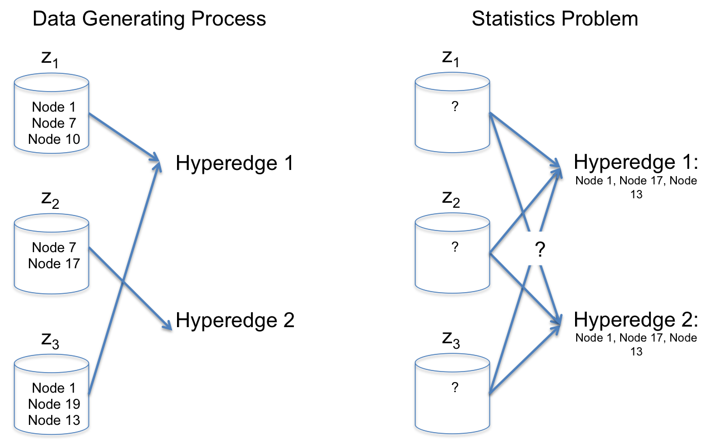

#### Problem
Come up with a way to split up "large" hyperedges, those of size $>k$, into subsets up to size $k$ that occur with high empiricial probability.

#### Comparison 
We consider a simplified data generating process in which hyperedges are made up of itemsets. Itemsets are sets of nodes. We simulate hyperedges by generating a probability distribution over random itemsets, $Z$. Then, for each edge, we generate a Poisson random variable, $N$, that determines how many itemsets will be contained in the edge. Then we choose $n$ itemsets according to the itemset distribution. In the real world, each itemset would have a distribution over nodes and, thus, wouldn't always appear in its exact form as they do in this simulation. Using this simplified approach, we see how well we can recover the true $Z$ distribution from simulated hyperedges using the apriori algorithm and LDA.

```{r, out.width = "600px", warning=F,message=FALSE,echo=FALSE}

```

#### Simulate Hypergraph

We first simulate hyperedges. To begin, we come up with a distribution of itemsets, $Z$, from 40 nodes/ items. This can be seen below. Then, we simulate 2,000 hyperedges, each of which contains some number of these itemsets, determined by a draw from the poisson distribution with parameter $\lambda=1$. 

```{r, echo=F, warning=F, message=FALSE}
library(arules)
library(knitr)
nItems = 40

############ SIMULATE TRANSACTIONS (using Agrawal method) ############
nTrans = 2000
# generate random itemsets and give them a probability distribution
patterns <- random.patterns(nItems = nItems, nPats = 5, corr = 0.1, 
                            lPats = 2, cmean = .5, cvar = 0.1)

data = list()
for (i in 1:nTrans) {
  j = rpois(1,1)+1 # how many itemsets does the transaction contain (add one to avoid empty transactions)
  k = findInterval(runif(j), cumsum(patterns@quality$pWeights)) + 1 # which itemsets
  trans1 = c()
    for (q in 1:length(k)) {
      trans1 = c(trans1,patterns@items@itemInfo$labels[which(patterns@items@data[,k[q]]==TRUE)])
    }
  data[[i]] = unique(trans1)
}

# view a pmf of the patterns, the z's
l = as(items(patterns), "list")
z = sapply(l, function(x) paste(x, collapse = " "))
p_z = round(patterns@quality[,1],3)
item_pmf = as.data.frame(cbind(z,p_z))
names(item_pmf) = c("Z = itemsets", "P(Z=z)")
kable(item_pmf)
```

#### LDA

Latent Dirichlet Allocation (in this context) takes as a parameter $k$ and assumes that there are $k$ sets within $Z$, each of which consist of a multinomial distribution over the nodes. Furthermore, there is also a distribution over each element of $Z$ that is specific to each hyperedge. This model is the standard in topic modelling and doesn't seem to work very well in this context, probably because our observations are limited to binary strings and are of a relatively short length (as opposed to documents where words appear with integer frequency and the length is generally long). We fit the LDA model using $k=5$ and show the distribution over the top items within each of the 5 'topic' for, in our case, $z$ distributions. Ideally, these should match up with the true $Z$ distribution seen above. However, they don't appear to connect very well. 

```{r, warning=F, echo=F, message=F, eval=T}
library(topicmodels)
library(ggplot2)
library(tidyverse)
library(tidytext)
library(tm)

# see how LDA does
doc = sapply(data, function(x) paste(x,collapse=" "))
vs = VectorSource(doc)
tdm = DocumentTermMatrix(VCorpus(vs))
ap_lda <- LDA(tdm, k = 5, control = list(seed = 1234))
ap_topics <- tidy(ap_lda, matrix = "beta")

ap_top_terms <- ap_topics %>%
  group_by(topic) %>%
  top_n(6, beta) %>%
  ungroup() %>%
  arrange(topic, -beta)

ap_top_terms %>%
  mutate(term = reorder(term, beta)) %>%
  ggplot(aes(term, beta, fill = factor(topic))) +
  geom_col(show.legend = FALSE) +
  facet_wrap(~ topic, scales = "free") +
  coord_flip()

```

#### Apriori

We generate 'rules' using the apriori algorithm with a minimum support/ confidence of $.1$ and $.95$, respectively. Under this simulation method, these parameters typically generate around 20 rules. We summarize the rules by a grouping method where "left hand side" items that are dependent upon the same "right hand side" item are grouped, and items in the "right hand side" with the highest frequency are labelled for each column. One interesting thing that I have observed over many simulations is that the rows from this visualization (the 'right and side' items) contain most of the high probability items from the true $Z$ distribution.

```{r, warning=F, echo=F, message=F}
# see how apriori does
library(arulesViz)
data <- as(data, "transactions") # coerce to transaction data structure
rules <- apriori(data, parameter = list(supp = 0.1, conf = 0.95))
#a = sort(rules, by="lift")
#arules::inspect(head(a,25))
arules::inspect(rules)

#subrules <- rules[quality(rules)$lift > 2]
#plot(rules, method="graph", control=list(type="itemsets"))
plot(rules, method="grouped", control = list(k=10))
```


```{r, echo=F}
# data("Groceries")
# rules <- apriori(Groceries, parameter=list(support=0.001, confidence=0.5))
# subrules2 <- head(sort(rules, by="lift"), 10)
# plot(subrules2, method="graph")
```